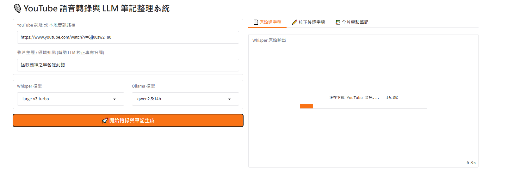
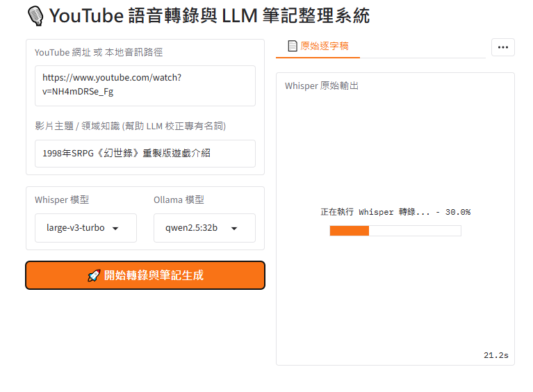
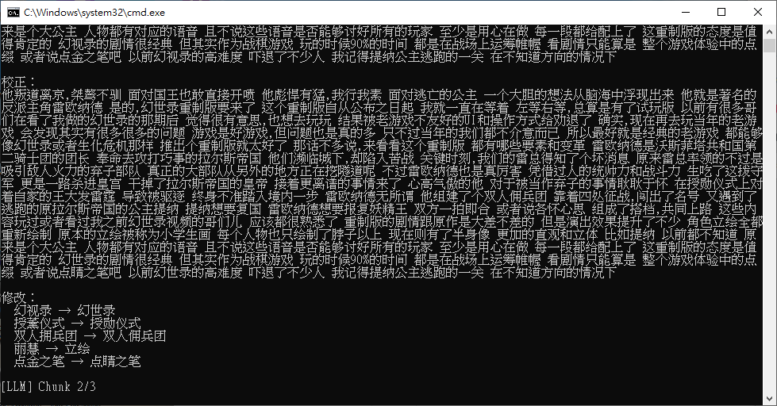
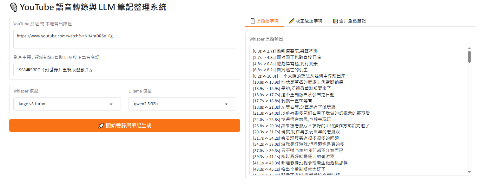
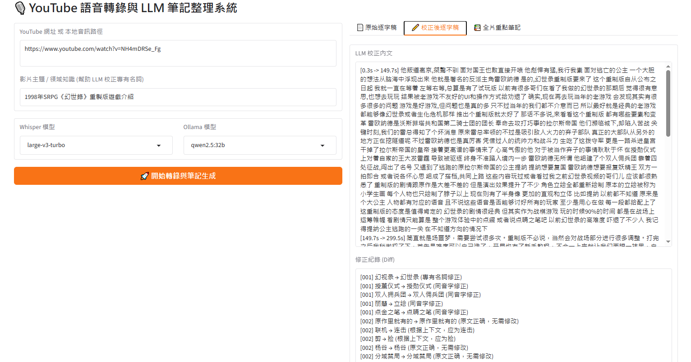
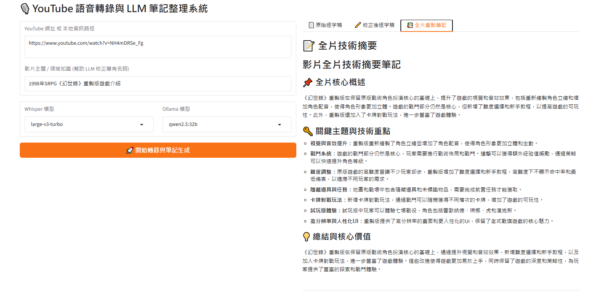

# FFNote 使用說明

## 安裝步驟

1. 使用者須先安裝ollama，以及自己想使用的模型
2. 下載FFNote[📥 點我直接下載專案 ZIP](https://github.com/ChinYi-Chiu/FFNote/archive/refs/heads/main.zip")
3. 解壓縮，然後執行setup.bat建置環境
4. 完成後執行run_gui.bat開啟服務

## 介面和功能說明

輸入YouTube 網址或是本地端影片的檔案位置，並且輸入影片主題或是專業領域相關名詞。
按下開始轉錄與筆記生成，就會開始下載目標影片的串流音訊。

轉錄逐字稿中。

針對逐字稿進行校正，看有那些不合理的字詞。

實際上校正的流程可以在CMD看到。

結束校正後開始製作筆記(分段筆記和總體筆記。

## 結果輸出

逐字稿生成：

校正後的逐字稿：

筆記：

